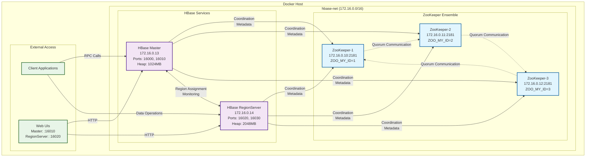
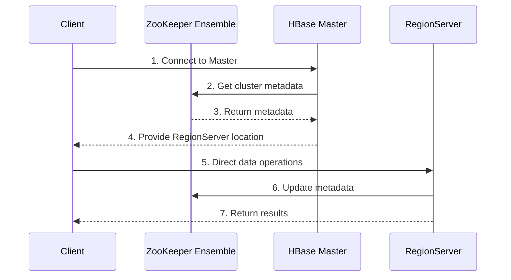
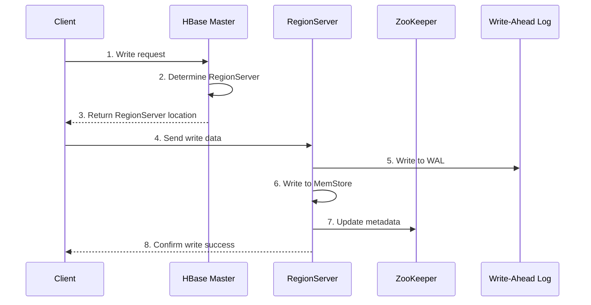
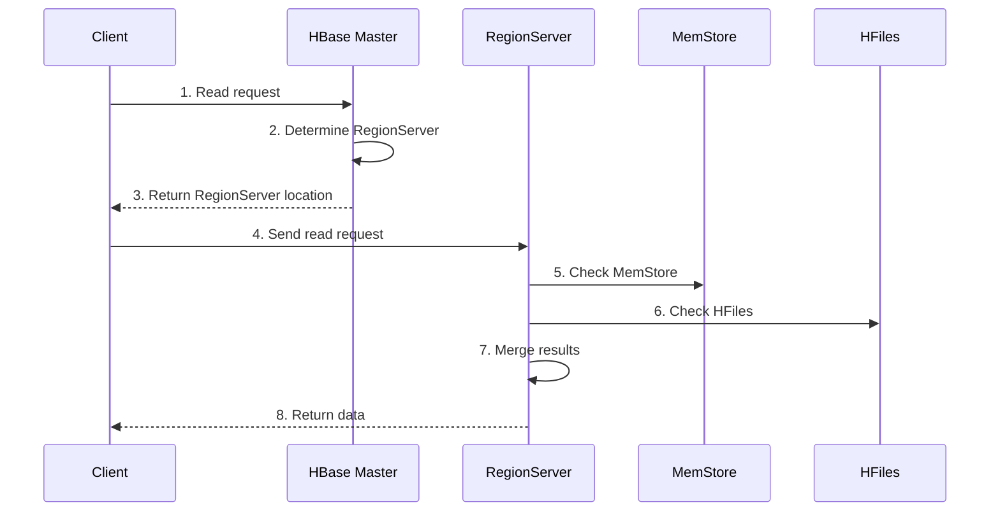

# HBase Docker Cluster Architecture

## Overview

This document provides a comprehensive technical overview of the HBase Docker cluster architecture, including component interactions, network topology, and configuration details.

## System Architecture

### High-Level Architecture



## Component Details

### 1. ZooKeeper Ensemble

The cluster uses a 3-node ZooKeeper ensemble for distributed coordination and configuration management.

#### Configuration

- **Image**: `zookeeper:3.9`
- **Ensemble Size**: 3 nodes
- **Internal Port**: 2181 (all nodes)
- **External Ports**: 2181, 2182, 2183 (mapped to host)
- **Network**: Custom bridge network with static IPs

#### Node Specifications

| Node | Container | Host Port | Internal IP | ZOO_MY_ID |
|------|-----------|-----------|-------------|-----------|
| zookeeper-1 | zookeeper-1 | 2181 | 172.16.0.10 | 1 |
| zookeeper-2 | zookeeper-2 | 2182 | 172.16.0.11 | 2 |
| zookeeper-3 | zookeeper-3 | 2183 | 172.16.0.12 | 3 |

#### ZooKeeper Server Configuration

```properties
# Each node has identical server configuration
ZOO_SERVERS=server.1=zookeeper-1:2888:3888;2181 server.2=zookeeper-2:2888:3888;2181 server.3=zookeeper-3:2888:3888;2181
```

- **Port 2888**: Follower communication
- **Port 3888**: Leader election
- **Port 2181**: Client connections

### 2. HBase Master

The HBase Master is responsible for cluster coordination, metadata management, and region assignment.

#### Configuration

- **Image**: `harisekhon/hbase:2.0`
- **Container**: hbase-master
- **Internal IP**: 172.16.0.13
- **Ports**: 16000 (RPC), 16010 (Web UI)
- **Heap Size**: 1024MB

#### Key Environment Variables

```yaml
HBASE_MANAGES_ZK: false                    # Use external ZooKeeper
HBASE_ZOOKEEPER_QUORUM: zookeeper-1,zookeeper-2,zookeeper-3
HBASE_ZOOKEEPER_PROPERTY_CLIENTPORT: 2181
HBASE_ZNODE_PARENT: /hbase-unsecure
HBASE_HEAPSIZE: 1024
```

#### Responsibilities

- Cluster state management
- Region assignment and load balancing
- Metadata operations (table creation, deletion)
- Master failover coordination
- RegionServer monitoring

### 3. HBase RegionServer

The RegionServer handles data storage, retrieval, and processing for assigned regions.

#### Configuration

- **Image**: `harisekhon/hbase:2.0`
- **Container**: hbase-regionserver
- **Internal IP**: 172.16.0.14
- **Ports**: 16020 (RPC), 16030 (Info)
- **Heap Size**: 2048MB

#### Key Environment Variables

```yaml
HBASE_MANAGES_ZK: false
HBASE_ZOOKEEPER_QUORUM: zookeeper-1,zookeeper-2,zookeeper-3
HBASE_ZOOKEEPER_PROPERTY_CLIENTPORT: 2181
HBASE_ZNODE_PARENT: /hbase-unsecure
HBASE_MASTER: hbase-master:16000
HBASE_HEAPSIZE: 2048
```

#### Responsibilities

- Data storage and retrieval
- Region management
- Write-ahead log (WAL) management
- Compaction and splitting
- Client request processing

## Network Architecture

### Custom Docker Network

The cluster uses a custom bridge network with the following specifications:

```yaml
networks:
  hbase-net:
    driver: bridge
    ipam:
      config:
        - subnet: 172.16.0.0/16
          gateway: 172.16.0.1
```

#### Network Characteristics

- **Type**: Bridge network
- **Subnet**: 172.16.0.0/16 (65,536 addresses)
- **Gateway**: 172.16.0.1
- **IP Range**: 172.16.0.2 - 172.16.255.254
- **Static IP Assignment**: All services have fixed IPs

#### IP Allocation

| Service | IP Address | Purpose |
|---------|------------|---------|
| Gateway | 172.16.0.1 | Network gateway |
| zookeeper-1 | 172.16.0.10 | Primary ZooKeeper |
| zookeeper-2 | 172.16.0.11 | Secondary ZooKeeper |
| zookeeper-3 | 172.16.0.12 | Tertiary ZooKeeper |
| hbase-master | 172.16.0.13 | HBase Master |
| hbase-regionserver | 172.16.0.14 | HBase RegionServer |

## Port Mapping

### External Ports (Host → Container)

| Service | External Port | Internal Port | Protocol | Purpose |
|---------|---------------|---------------|----------|---------|
| zookeeper-1 | 2181 | 2181 | TCP | ZooKeeper client connections |
| zookeeper-2 | 2182 | 2181 | TCP | ZooKeeper client connections |
| zookeeper-3 | 2183 | 2181 | TCP | ZooKeeper client connections |
| hbase-master | 16000 | 16000 | TCP | HBase Master RPC |
| hbase-master | 16010 | 16010 | TCP | HBase Master Web UI |
| hbase-regionserver | 16020 | 16020 | TCP | RegionServer RPC |
| hbase-regionserver | 16030 | 16030 | TCP | RegionServer Info |

### Internal Communication Ports

| Service | Port | Purpose |
|---------|------|---------|
| ZooKeeper | 2888 | Follower communication |
| ZooKeeper | 3888 | Leader election |

## Data Flow Architecture

### 1. Client Request Flow



### 2. Write Operation Flow



### 3. Read Operation Flow



## Configuration Management

### ZooKeeper Configuration

The ZooKeeper ensemble uses a quorum-based configuration where:

- **Minimum nodes for quorum**: 2 out of 3
- **Leader election**: Automatic failover
- **Data consistency**: Strong consistency guarantees

### HBase Configuration

#### Master Configuration

- **ZooKeeper Integration**: External ZooKeeper management
- **Heap Size**: 1024MB (suitable for small to medium clusters)
- **Security**: Unsecure mode (development/testing)

#### RegionServer Configuration

- **Master Communication**: Direct connection to hbase-master:16000
- **Heap Size**: 2048MB (larger for data processing)
- **ZooKeeper Integration**: Same quorum as Master

## High Availability Features

### ZooKeeper High Availability

- **3-node ensemble**: Tolerates 1 node failure
- **Automatic failover**: Leader election on failure
- **Data replication**: All data replicated across nodes

### HBase High Availability

- **Master failover**: Automatic failover (with multiple masters)
- **RegionServer monitoring**: Automatic detection of failures
- **Data replication**: Configurable replication factor

## Performance Characteristics

### Memory Allocation

- **ZooKeeper**: Default heap (typically 256MB per node)
- **HBase Master**: 1024MB
- **HBase RegionServer**: 2048MB
- **Total Memory**: ~4GB minimum

### Scalability Considerations

- **Horizontal scaling**: Add more RegionServers
- **Vertical scaling**: Increase heap sizes
- **Network bandwidth**: Consider network capacity for large datasets

## Security Model

### Current Configuration

- **Authentication**: None (unsecure mode)
- **Authorization**: None
- **Encryption**: None
- **Network**: Internal Docker network only

### Production Considerations

- Implement Kerberos authentication
- Enable SSL/TLS encryption
- Configure proper authorization policies
- Use external network security

## Monitoring and Observability

### Web Interfaces

- **HBase Master UI**: <http://localhost:16010>
- **RegionServer UI**: <http://localhost:16020>

### Key Metrics

- **Cluster health**: Master UI dashboard
- **Region distribution**: Master UI
- **RegionServer status**: RegionServer UI
- **ZooKeeper status**: Command line tools

## Troubleshooting Guide

### Common Issues

1. **Port Conflicts**
   - Check if required ports are available
   - Modify port mappings if necessary

2. **Memory Issues**
   - Increase Docker memory limits
   - Adjust heap sizes in configuration

3. **Network Issues**
   - Verify Docker network creation
   - Check IP address assignments

4. **ZooKeeper Issues**
   - Verify ensemble configuration
   - Check quorum status

### Diagnostic Commands

```bash
# Check ZooKeeper status
echo "stat" | nc localhost 2181

# Check HBase Master status
curl -s http://localhost:16010/master-status

# Check RegionServer status
curl -s http://localhost:16020/rs-status

# View container logs
docker compose logs [service-name]
```

## Future Enhancements

### Recommended Improvements

1. **Multiple Masters**: Add standby master for HA
2. **Data Persistence**: Mount volumes for data persistence
3. **Security**: Implement Kerberos authentication
4. **Monitoring**: Add Prometheus/Grafana monitoring
5. **Backup**: Implement automated backup strategies
6. **Scaling**: Add auto-scaling capabilities

### Production Readiness Checklist

- [ ] Implement authentication and authorization
- [ ] Add data persistence with volumes
- [ ] Configure monitoring and alerting
- [ ] Implement backup and recovery procedures
- [ ] Add multiple master nodes
- [ ] Configure proper logging
- [ ] Implement security hardening
- [ ] Add performance tuning
