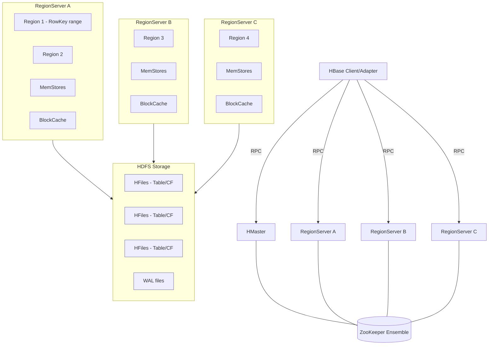

# 📘 Tài liệu tổng quan về Apache HBase

## 1️⃣ Giới thiệu chung

**Apache HBase** là một cơ sở dữ liệu **NoSQL phân tán**, **mở rộng theo chiều ngang (horizontally scalable)**, **hướng cột (column-oriented)**, được xây dựng trên nền tảng của **HDFS (Hadoop Distributed File System)**.

Nó được thiết kế để:

* Lưu trữ **hàng tỷ bản ghi**, **hàng petabyte dữ liệu** trên nhiều node.
* Cho phép **đọc/ghi ngẫu nhiên theo khóa dòng (row key)** với độ trễ thấp.
* Hỗ trợ **tích hợp chặt chẽ** với hệ sinh thái Big Data: Hadoop, Spark, Hive, Flink, Kafka,...

HBase là bản **mã nguồn mở của Google Bigtable**.

---

## 2️⃣ Kiến trúc tổng quan HBase



---

## 3️⃣ Các thành phần chính trong HBase

| Thành phần                      | Mô tả                                                                         | Vai trò                                                                                                                                                                    |
| ------------------------------- | ----------------------------------------------------------------------------- | -------------------------------------------------------------------------------------------------------------------------------------------------------------------------- |
| **HMaster**                     | Master server điều phối toàn hệ thống.                                        | - Quản lý region assignment (phân chia và cân bằng region giữa các RegionServer).</br>- Quản lý schema (tạo, xóa bảng, namespace).</br>- Giám sát RegionServer (alive/dead). |
| **RegionServer**                | Node chịu trách nhiệm lưu trữ và xử lý dữ liệu thực tế.                       | - Mỗi RegionServer chứa nhiều *Region*.</br>- Xử lý các yêu cầu *read/write* từ client.</br>- Flush dữ liệu từ RAM xuống HDFS.                                               |
| **Region**                      | Phân vùng dữ liệu của bảng (theo range của RowKey).                           | - Tự động *split* khi kích thước vượt ngưỡng (thường ~10GB).</br>- Mỗi Region gồm nhiều *Store* (theo ColumnFamily).                                                        |
| **Store (Column Family Store)** | Tập hợp các cột cùng một *Column Family*.                                     | - Gồm 2 thành phần: *MemStore* (RAM) và *HFile* (HDFS).                                                                                                                    |
| **MemStore**                    | Bộ nhớ tạm thời lưu dữ liệu mới ghi.                                          | - Khi đầy, dữ liệu sẽ *flush* thành HFile.                                                                                                                                 |
| **HFile**                       | File thực tế chứa dữ liệu trong HDFS.                                         | - Cấu trúc tối ưu cho scan tuần tự và tìm kiếm nhanh.                                                                                                                      |
| **WAL (Write Ahead Log)**       | File log ghi lại mọi thao tác ghi (Put/Delete) trước khi commit vào MemStore. | - Giúp khôi phục dữ liệu khi RegionServer bị crash.                                                                                                                        |
| **ZooKeeper**                   | Hệ thống điều phối và theo dõi cluster.                                       | - Quản lý thông tin HMaster, RegionServer.</br>- Đảm bảo HA (High Availability).                                                                                            |

---

## 4️⃣ Mô hình dữ liệu của HBase

HBase lưu dữ liệu theo mô hình **bảng (table)**, nhưng **không có schema cột cố định như RDBMS**.

### Cấu trúc logic

```text
Table → Region(s) → ColumnFamily → ColumnQualifier → Cell(Value + Timestamp)
```

### Ví dụ minh họa

| Row Key | info:name   | info:email                                  | stats:score |
| ------- | ----------- | ------------------------------------------- | ----------- |
| user1   | "Hải Phạm"  | "[hai@example.com](mailto:hai@example.com)" | 95          |
| user2   | "An Nguyễn" | "[an@example.com](mailto:an@example.com)"   | 88          |

→ Ở đây:

* Bảng có 2 **Column Families**: `info`, `stats`
* Mỗi Family chứa các cột con (**Column Qualifiers**): `name`, `email`, `score`
* Mỗi ô (Cell) có **timestamp** → cho phép lưu nhiều phiên bản.

---

## 5️⃣ Cách tổ chức dữ liệu bên trong HBase

### 5.1 Row Key

* Là **khóa duy nhất** xác định một dòng.
* Dữ liệu được **sắp xếp theo thứ tự byte lexicographic** của RowKey.
* Thiết kế RowKey hợp lý giúp **scan nhanh hơn** và tránh **hot region**.

Ví dụ RowKey tốt cho hệ thống multi-tenant:

```text
<workspace_id>|<data_type>|<object_id>
ws001|profile|p123
ws001|event|e789
```

### 5.2 Column Family

* Các cột cùng Family được **lưu trên cùng HFile** → đọc nhanh hơn.
* Family nên **ít thay đổi** và **ít số lượng** (thường 1–3 CF là đủ).

### 5.3 Cell (ô dữ liệu)

* Mỗi Cell được xác định bởi `(RowKey, ColumnFamily, Qualifier, Timestamp)`
* Lưu nhiều **phiên bản (versions)** theo timestamp.

### 5.4 HFile và MemStore

* Khi client ghi dữ liệu:

  1. Ghi log vào **WAL** (đảm bảo durability)
  2. Ghi dữ liệu vào **MemStore**
  3. Khi MemStore đầy → flush xuống HDFS thành **HFile**
  4. Nhiều HFile → hợp nhất qua **compaction**

---

## 6️⃣ Chu trình ghi (Write Path)

```text
Client
  ↓
Write Ahead Log (WAL)
  ↓
MemStore (RAM)
  ↓ (flush)
HFile (HDFS)
  ↓ (compact)
Merged HFile
```

Cơ chế này đảm bảo:

* **Durability**: Dữ liệu không mất khi server crash (nhờ WAL)
* **Consistency**: Mỗi row là atomic (ghi một lần, đọc một lần)

---

## 7️⃣ Chu trình đọc (Read Path)

```text
Client
  ↓
RegionServer
  ├── BlockCache (cache trong RAM)
  ├── MemStore
  └── HFile (HDFS)
```

Khi đọc:

1. Kiểm tra BlockCache.
2. Nếu không có → đọc từ MemStore.
3. Nếu vẫn không có → đọc từ HFile.
4. Kết hợp dữ liệu theo timestamp và trả về bản mới nhất.

---

## 8️⃣ So sánh giữa HBase và RDBMS

| Tiêu chí                    | **HBase**                                  | **RDBMS (MySQL, PostgreSQL, …)**   |
| --------------------------- | ------------------------------------------ | ---------------------------------- |
| **Kiểu dữ liệu**            | NoSQL, hướng cột                           | Quan hệ, hướng hàng                |
| **Schema**                  | Linh hoạt, cột có thể thay đổi tùy dòng    | Schema cố định                     |
| **Khóa chính**              | Chỉ 1 khóa dòng (RowKey)                   | Khóa chính và khóa ngoại           |
| **Giao dịch (Transaction)** | Atomic ở mức Row                           | ACID toàn bảng                     |
| **Ngôn ngữ truy vấn**       | API Java / REST / Thrift / SQL qua Phoenix | SQL chuẩn                          |
| **Phân vùng dữ liệu**       | Theo range của RowKey                      | Thường manual hoặc sharding        |
| **Khả năng mở rộng**        | Rất cao (hàng trăm node)                   | Giới hạn trong 1 node (scale up)   |
| **Tốc độ đọc/ghi**          | Ghi nhanh, đọc tuần tự tốt                 | Tối ưu truy vấn phức tạp           |
| **Use-case chính**          | Dữ liệu lớn, IoT, Time-series, Data lake   | OLTP, hệ thống giao dịch tài chính |
| **Indexing**                | Không có secondary index mặc định          | Có nhiều loại index                |
| **Join**                    | Không hỗ trợ trực tiếp                     | Hỗ trợ mạnh mẽ                     |

---

## 9️⃣ Khi nào nên chọn HBase

| Phù hợp                                    | Không phù hợp                            |
| ------------------------------------------ | ---------------------------------------- |
| Cần lưu **dữ liệu khổng lồ (TB–PB)**       | Dữ liệu nhỏ và cần join phức tạp         |
| **Truy cập ngẫu nhiên** theo RowKey        | Cần query đa điều kiện hoặc aggregations |
| Có **các hệ thống Hadoop / Spark / Kafka** | Cần transaction mạnh                     |
| Dữ liệu dạng **time-series, logs, sensor** | Ứng dụng web thông thường                |

---

## 🔟 Ví dụ thực tế

| Use-case                         | Mô tả                                                           |
| -------------------------------- | --------------------------------------------------------------- |
| **Facebook Messaging**           | Từng dùng HBase để lưu message log.                             |
| **IoT Sensor Data**              | Ghi dữ liệu cảm biến hàng giây, hàng tỷ điểm dữ liệu.           |
| **Search Engine Indexing**       | Lưu trữ tokenized documents.                                    |
| **Customer Data Platform (CDP)** | Lưu raw profile, event, segmentation logs (giống bạn đang làm). |

---

## 🧭 Tóm tắt trực quan

| Khái niệm            | Mức tương đương trong RDBMS                    |
| -------------------- | ---------------------------------------------- |
| **Namespace**        | Database                                       |
| **Table**            | Table                                          |
| **Column Family**    | Tương tự “column group” (không có trong RDBMS) |
| **Row Key**          | Primary Key                                    |
| **Column Qualifier** | Column name                                    |
| **Cell**             | (Row, Column) Value                            |
| **Region**           | Partition/Shard                                |
| **RegionServer**     | Data Node                                      |
| **HMaster**          | Coordinator / Meta Server                      |

---

## 📑 Nguồn tham khảo khuyến nghị

* [Apache HBase Reference Guide](https://hbase.apache.org/book.html)
* [Bigtable: A Distributed Storage System for Structured Data (Google Paper)](https://research.google/pubs/pub27898/)
* *HBase: The Definitive Guide* — Lars George (O’Reilly, 2nd Edition)
* [HBase Architecture Deep Dive – Cloudera Blog](https://blog.cloudera.com/)

---
